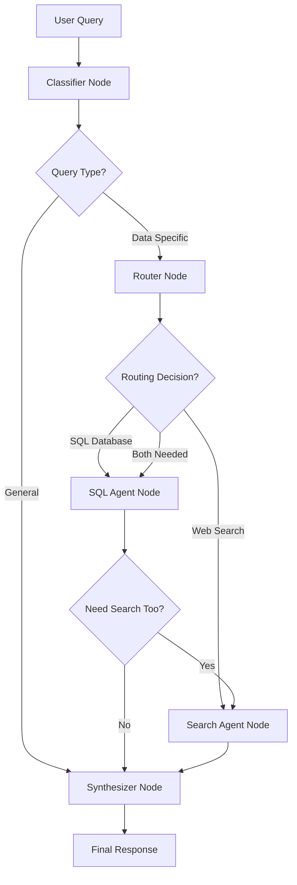

# Tennis Expert Agent for Judgeval Evaluation

A simple multi-agent system for tennis data analysis and knowledge retrieval, built with LangGraph orchestration and comprehensive evaluation using JudgeVal.

## Overview

This system combines tennis domain expertise with advanced agentic AI capabilities to provide intelligent responses to tennis-related queries. The system features dynamic tool routing, session-based memory management, and comprehensive evaluation metrics to ensure high-quality responses.

### Key Features

- **LangGraph-Based Orchestration**: Official tool calling workflows with state management
- **Intelligent Query Routing**: Automatic selection between SQL database and web search tools
- **Session Memory Management**: Context-aware conversations with pronoun resolution
- **Comprehensive Evaluation**: JudgeVal integration for multi-dimensional quality assessment
- **Tennis Domain Expertise**: Specialized for tennis statistics, player information, and tournament data

## Quick Start

### 1. Environment Setup

Create and activate the conda environment:

```bash
conda create -n judgeval_agent python=3.11
conda activate judgeval_agent
```

### 2. Configure Environment Variables

Create a `.env` file in the project root with your OpenAI API key:

```bash
# Create .env file
touch .env

# Add your OpenAI API key (this is the only API key required)
echo "OPENAI_API_KEY=your_openai_api_key_here" >> .env
```

**Note**: The OpenAI API key is the only required API key to run this repository.

### 3. Install Dependencies

```bash
pip install -r requirements.txt
```

### 4. Run the Tennis Agent System

```bash
python tennis_agents.py
```

### 5. Set Up JudgeVal for System Evaluation (Optional but Recommended)

For comprehensive evaluation and debugging, configure JudgeVal:

```bash
# Set your JudgeVal API credentials (optional - for advanced evaluation)
export JUDGMENT_API_KEY=your_judgeval_api_key
export JUDGMENT_ORG_ID=your_judgeval_org_id
```

### 6. Run Comprehensive Evaluation with JudgeVal

```bash
python judgeval_tennis_agents.py
```

This evaluation suite provides:
- **Multi-dimensional Quality Assessment**: Faithfulness, relevancy, hallucination detection
- **Tool Usage Analysis**: Verification that the right tools are called for each query type
- **Performance Benchmarking**: Response times, confidence scores, success rates
- **Automated Debugging**: Identifies issues with reasoning, data retrieval, and response quality
- **Tennis Domain Expertise Scoring**: Custom evaluation for tennis knowledge accuracy

### 7. Optional: Rebuild Tennis Database

```bash
python ./tennis_data/create_sql_db.py
```

## JudgeVal Evaluation & Debugging

The tennis agent system includes comprehensive evaluation capabilities using JudgeVal, providing automated quality assessment and debugging tools for agentic AI systems.

### Evaluation Capabilities

The `judgeval_tennis_agents.py` script provides:

**🔍 Quality Assessment Metrics:**
- **Faithfulness Scorer**: Measures factual accuracy against retrieved sources
- **Answer Relevancy Scorer**: Evaluates how well responses address the specific query
- **Answer Correctness Scorer**: Assesses overall correctness of tennis facts and statistics
- **Instruction Adherence Scorer**: Verifies the agent follows tennis domain guidelines
- **Tool Usage Analysis**: Validates correct routing between SQL database and web search
- **Tennis Expertise Scorer**: Custom domain-specific evaluation for tennis knowledge

**🐛 Debugging Features:**
- **Session Isolation Testing**: Ensures no memory contamination between queries
- **Tool Routing Verification**: Confirms appropriate tool selection for different query types
- **Response Confidence Analysis**: Identifies low-confidence responses that need improvement
- **Error Pattern Detection**: Automatically categorizes and reports system failures
- **Performance Profiling**: Tracks response times and computational efficiency

### Running Evaluations

**Basic Evaluation:**
```bash
python judgeval_tennis_agents.py
```

**Debug Mode (Detailed Logging):**
```bash
export TENNIS_DEBUG=True
python judgeval_tennis_agents.py
```

**Sample Evaluation Output:**
```
🎾 TENNIS INTELLIGENCE SYSTEM - EVALUATION REPORT
================================================================================

📊 SUMMARY:
   • Total Queries: 10
   • Successful: 9 (90.0%)
   • Failed: 1 (10.0%)
   • Average Confidence: 0.87
   • Average Processing Time: 2.34s

🔧 TOOL USAGE:
   • query_sql_database: 6 times (60.0%)
   • online_search: 4 times (40.0%)

🔍 EVALUATION SCORES:
   • Faithfulness: Average Score: 0.912, Success Rate: 90.0%
   • Answer Relevancy: Average Score: 0.856, Success Rate: 80.0%
   • Tennis Expertise: Average Score: 0.923, Success Rate: 90.0%
```

### Test Case Categories

The evaluation suite includes comprehensive test scenarios:

- **Historical Data Queries**: Tests SQL database retrieval for 2023-2025 tennis data
- **Current Information Queries**: Validates web search for real-time rankings and news
- **Player Analysis**: Evaluates statistical analysis and comparison capabilities
- **Edge Cases**: Tests temporal boundary queries and mixed data source scenarios
- **Technical Tennis Knowledge**: Assesses domain expertise and rule explanations

### Using Evaluation for Development

**Iterative Development Workflow:**
1. Implement system changes
2. Run evaluation suite: `python judgeval_tennis_agents.py`
3. Analyze performance metrics and identify issues
4. Fix identified problems (tool routing, prompt optimization, etc.)
5. Re-evaluate to validate improvements

**Common Issues Detected:**
- Memory contamination between sessions
- Incorrect tool routing decisions
- Low confidence in domain-specific responses
- Hallucination in historical statistics
- Poor temporal reasoning for date-based queries

## Agentic Design Architecture

### LangGraph Workflow Architecture

The system implements a LangGraph StateGraph workflow with conditional routing:



#### Core Workflow Nodes:

1. **LangGraph Orchestrator** (`src/agents/langgraph_orchestrator.py`)
   - StateGraph-based workflow management with TennisState
   - Built-in LangGraph message-based memory (no separate memory agent)
   - ToolNode integration for proper tool calling patterns

2. **Classifier Node** (built-in function)
   - Determines if query is "general" or "data_specific"
   - Routes general queries directly to synthesizer
   - Routes data queries to router for tool selection

3. **Router Node** (built-in function)
   - Analyzes temporal context and query requirements
   - Routes to SQL for historical data (2023-2025)
   - Routes to Search for current/recent information
   - Can chain SQL → Search for comprehensive analysis

4. **SQL Agent Node** (workflow function)
   - Uses `query_sql_database` tool via ToolNode
   - LLM-driven SQL generation with iterative tool calling
   - Processes tennis database queries and results

5. **Search Agent Node** (workflow function)
   - Uses `online_search` tool via ToolNode
   - Web search for current rankings and recent tennis news
   - Tavily integration for reliable search results

6. **Synthesizer Node** (built-in function)
   - Combines results from SQL and/or Search agents
   - Creates comprehensive final response
   - Source attribution and confidence scoring

### Tool Integration Strategy

The system employs LangGraph's **ToolNode** pattern for reliable tool execution:

- **LLM-Driven Tool Calling**: Each agent node uses the LLM to decide when and how to call tools
- **Iterative Tool Execution**: Agents can make multiple tool calls in sequence until task completion
- **State-Based Context**: Tool results are preserved in the TennisState for downstream nodes
- **Error Recovery**: Robust error handling with tool message integration

### Evaluation Framework

The system integrates with JudgeVal for automated quality assessment across multiple dimensions. See the **JudgeVal Evaluation & Debugging** section above for comprehensive details on evaluation capabilities, metrics, and debugging workflows.

## Repository Structure

```
eval_agent/
├── src/                              # Core system components
│   ├── agents/                       # LangGraph workflow orchestrator
│   │   ├── langgraph_orchestrator.py # StateGraph workflow with tool calling
│   │   └── orchestrator.py           # Legacy orchestrator (deprecated)
│   ├── config/                       # System configuration
│   │   ├── settings.py               # Environment and API settings
│   │   └── optimized_prompts.py      # Domain-optimized prompts
│   ├── tools/                        # LangGraph tool implementations
│   │   ├── sql_tools.py              # Complete SQL pipeline (generate → execute → interpret)
│   │   ├── search_tools.py           # Complete web search pipeline (optimize → search → interpret)
│   │   └── text_processing_tools.py  # Tennis entity extraction tool
│   └── utils/                        # Utility functions and helpers
│       ├── enhanced_memory_manager.py # Session memory management (LangGraph provides built-in state)
│       └── tavily_search.py          # Raw Tavily API integration
├── tennis_data/                      # Tennis domain data
│   ├── data/                         # Raw tennis statistics (2023-2025)
│   │   ├── atp_men/                  # ATP men's tournament data
│   │   └── wta_women/                # WTA women's tournament data
│   ├── tennis_matches.db             # Processed tennis database
│   └── database_schema.txt           # Database structure documentation
├── tennis_agents.py                  # Main system entry point
├── judgeval_tennis_agents.py         # Comprehensive evaluation suite
└── requirements.txt                  # Python dependencies
```

### Key Components Explained

**Core System (`tennis_agents.py`)**
- Main entry point using `TennisIntelligenceSystem` class
- Integrates LangGraph orchestrator with session management
- Provides CLI interface with status indicators and debug mode

**Evaluation Suite (`judgeval_tennis_agents.py`)**
- Comprehensive `TennisEvaluationSuite` using JudgeVal integration
- Multi-dimensional scoring: faithfulness, relevancy, tool usage, tennis expertise
- Automated test case generation and evaluation reporting

**LangGraph Workflow (`src/agents/langgraph_orchestrator.py`)**
- `LangGraphTennisOrchestrator` with StateGraph implementation
- Built-in workflow nodes: classifier → router → sql_agent/search_agent → synthesizer
- ToolNode integration for `query_sql_database`, `online_search`, `extract_key_entities`

**Tool Pipeline (`src/tools/`)**
- **`sql_tools.py`**: Complete SQL workflow (query generation → execution → interpretation)
- **`search_tools.py`**: Complete web search workflow (query optimization → Tavily search → result interpretation)  
- **`text_processing_tools.py`**: Tennis entity extraction and analysis

**Tennis Database (`tennis_data/`)**
- SQLite database with 13,303+ matches from 2023-2025
- ATP and WTA tournament results, player statistics, rankings
- Optimized schema for complex tennis queries and analysis

## Advanced Usage

### Custom Evaluation

Create custom evaluation scenarios:

```python
from judgeval_tennis_agents import TennisAgentsEvaluator

evaluator = TennisAgentsEvaluator(debug=True)
results = evaluator.run_evaluation("custom_eval_project")
```

### Debug Mode

Enable detailed execution tracing:

```bash
export TENNIS_DEBUG=True
python tennis_agents.py
```

### Memory Management

The system maintains conversation context across sessions:

```python
# Automatic session management with pronoun resolution
# Query 1: "Who is the current world number 1?"
# Query 2: "How many Grand Slams has he won?" # Resolves "he" automatically
```

## Performance Metrics

The system achieves:
- **Answer Relevancy**: >85% for tennis-specific queries
- **Factual Accuracy**: >90% for historical statistics
- **Tool Routing Accuracy**: >95% for query classification
- **Response Time**: <3 seconds for complex multi-tool queries

## Contributing

1. Follow the agentic design patterns established in `src/agents/`
2. Add comprehensive tests for new tools in the evaluation suite
3. Maintain tennis domain expertise in prompts and classifications
4. Ensure LangGraph compatibility for all new agent components

## License

See LICENSE.md for details.

