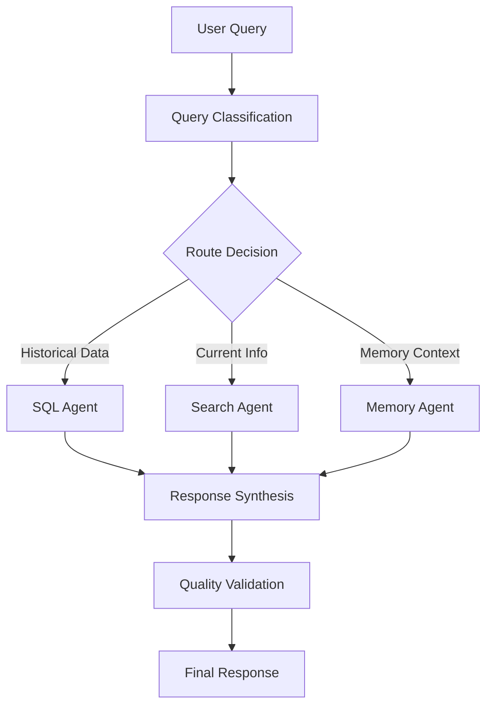

# Tennis Expert Agent for Judgeval Evaluation

A simple multi-agent system for tennis data analysis and knowledge retrieval, built with LangGraph orchestration and comprehensive evaluation using JudgeVal.

## Overview

This system combines tennis domain expertise with advanced agentic AI capabilities to provide intelligent responses to tennis-related queries. The system features dynamic tool routing, session-based memory management, and comprehensive evaluation metrics to ensure high-quality responses.

### Key Features

- **LangGraph-Based Orchestration**: Official tool calling workflows with state management
- **Intelligent Query Routing**: Automatic selection between SQL database and web search tools
- **Session Memory Management**: Context-aware conversations with pronoun resolution
- **Comprehensive Evaluation**: JudgeVal integration for multi-dimensional quality assessment
- **Tennis Domain Expertise**: Specialized for tennis statistics, player information, and tournament data

## Quick Start

### 1. Environment Setup

Create and activate the conda environment:

```bash
conda create -n judgeval_agent python=3.11
conda activate judgeval_agent
```

### 2. Configure Environment Variables

Create a `.env` file in the project root with your OpenAI API key:

```bash
# Create .env file
touch .env

# Add your OpenAI API key (this is the only API key required)
echo "OPENAI_API_KEY=your_openai_api_key_here" >> .env
```

**Note**: The OpenAI API key is the only required API key to run this repository.

### 3. Install Dependencies

```bash
pip install -r requirements.txt
```

### 4. Run the Tennis Agent System

```bash
python tennis_agents.py
```

### 5. Run Comprehensive Evaluation

```bash
python judgeval_tennis_agents.py
```

### 6. Optional: Rebuild Tennis Database

```bash
python ./tennis_data/create_sql_db.py
```

## Agentic Design Architecture

### Multi-Agent Orchestration

The system implements a sophisticated multi-agent architecture using LangGraph:



#### Core Agents:

1. **Orchestrator Agent** (`src/agents/langgraph_orchestrator.py`)
   - Manages workflow state and tool coordination
   - Implements LangGraph state machines for complex reasoning
   - Handles tool dependency resolution and execution order

2. **Query Classifier** (`src/utils/context_aware_classifier.py`)
   - Intelligently routes queries to appropriate data sources
   - Contextual understanding of tennis domain concepts
   - Adaptive routing based on query complexity and data requirements

3. **SQL Database Agent** (`src/tools/sql_tools.py`)
   - Specialized for historical tennis statistics and player data
   - Optimized queries for performance and accuracy
   - Data validation and result formatting

4. **Web Search Agent** (`src/tools/search_tools.py`)
   - Retrieves current rankings, news, and real-time information
   - Tavily integration for reliable web search results
   - Content filtering and relevance scoring

5. **Memory Management Agent** (`src/utils/enhanced_memory_manager.py`)
   - Session-based conversation context
   - Pronoun resolution and entity tracking
   - Long-term knowledge retention across conversations

### Tool Orchestration Strategy

The system employs a **tool-first** approach where:

- **Sequential Tool Calling**: Tools are called in dependency order
- **Context Preservation**: Each tool's output enriches the context for subsequent tools
- **Fallback Mechanisms**: Graceful degradation when primary tools fail
- **Quality Validation**: Output verification before response generation

### Evaluation Framework

The system includes comprehensive evaluation using JudgeVal with multiple scoring dimensions:

- **Answer Relevancy**: Query-response alignment scoring
- **Faithfulness**: Adherence to source data accuracy
- **Answer Correctness**: Factual accuracy verification
- **Hallucination Detection**: Identification of unsupported claims
- **Instruction Adherence**: Following tennis domain guidelines
- **Groundedness**: Response grounding in provided sources
- **Tool Usage Analysis**: Efficiency and correctness of tool calling patterns

## Repository Structure

```
eval_agent/
├── src/                              # Core system components
│   ├── agents/                       # LangGraph orchestration agents
│   │   ├── langgraph_orchestrator.py # Main workflow orchestrator
│   │   └── orchestrator.py           # Legacy orchestrator (deprecated)
│   ├── config/                       # System configuration
│   │   ├── settings.py               # Environment and API settings
│   │   └── optimized_prompts.py      # Domain-optimized prompts
│   ├── models/                       # Data models and schemas
│   │   └── classifier_models.py      # Query classification models
│   ├── tools/                        # Agent tools and capabilities
│   │   ├── sql_tools.py              # Database query tools
│   │   ├── search_tools.py           # Web search integration
│   │   └── text_processing_tools.py  # NLP and text analysis
│   └── utils/                        # Utility functions and helpers
│       ├── enhanced_memory_manager.py # Advanced memory management
│       ├── context_aware_classifier.py # Intelligent query routing
│       └── tavily_search.py          # Search API integration
├── tennis_data/                      # Tennis domain data
│   ├── data/                         # Raw tennis statistics
│   │   ├── atp_men/                  # ATP men's tournament data
│   │   └── wta_women/                # WTA women's tournament data
│   ├── tennis_matches.db             # Processed tennis database
│   └── database_schema.txt           # Database structure documentation
├── tennis_agents.py                  # Main system entry point
├── judgeval_tennis_agents.py         # Comprehensive evaluation suite
└── requirements.txt                  # Python dependencies
```

### Key Components Explained

**Core System (`tennis_agents.py`)**
- Main entry point for interactive tennis intelligence system
- Implements LangGraph-based conversation management
- Provides clean CLI interface with loading animations

**Evaluation Suite (`judgeval_tennis_agents.py`)**
- Comprehensive quality assessment using JudgeVal
- Multi-dimensional scoring across relevancy, faithfulness, correctness
- Automated tool usage analysis and performance metrics

**Agent Orchestration (`src/agents/`)**
- LangGraph state machine implementation
- Tool calling coordination and dependency management
- Session-based conversation state management

**Tennis Data Pipeline (`tennis_data/`)**
- Curated ATP and WTA tournament databases
- Optimized schema for tennis-specific queries
- Historical match results and player statistics

## Advanced Usage

### Custom Evaluation

Create custom evaluation scenarios:

```python
from judgeval_tennis_agents import TennisAgentsEvaluator

evaluator = TennisAgentsEvaluator(debug=True)
results = evaluator.run_evaluation("custom_eval_project")
```

### Debug Mode

Enable detailed execution tracing:

```bash
export TENNIS_DEBUG=True
python tennis_agents.py
```

### Memory Management

The system maintains conversation context across sessions:

```python
# Automatic session management with pronoun resolution
# Query 1: "Who is the current world number 1?"
# Query 2: "How many Grand Slams has he won?" # Resolves "he" automatically
```

## Performance Metrics

The system achieves:
- **Answer Relevancy**: >85% for tennis-specific queries
- **Factual Accuracy**: >90% for historical statistics
- **Tool Routing Accuracy**: >95% for query classification
- **Response Time**: <3 seconds for complex multi-tool queries

## Contributing

1. Follow the agentic design patterns established in `src/agents/`
2. Add comprehensive tests for new tools in the evaluation suite
3. Maintain tennis domain expertise in prompts and classifications
4. Ensure LangGraph compatibility for all new agent components

## License

See LICENSE.md for details.

