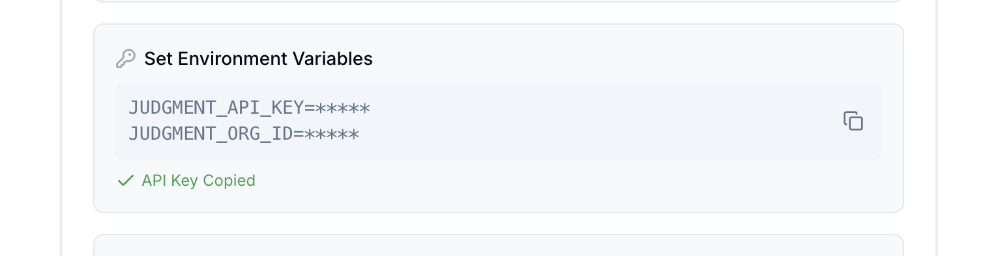
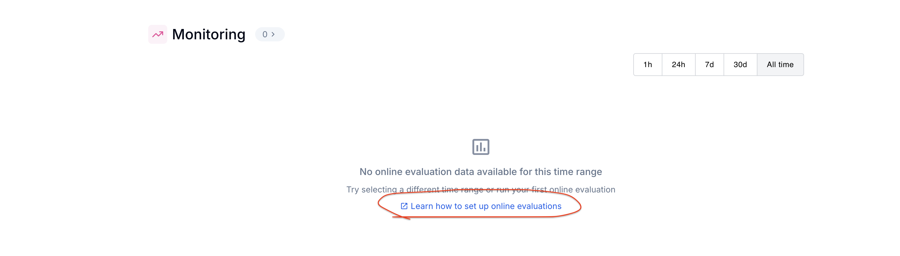
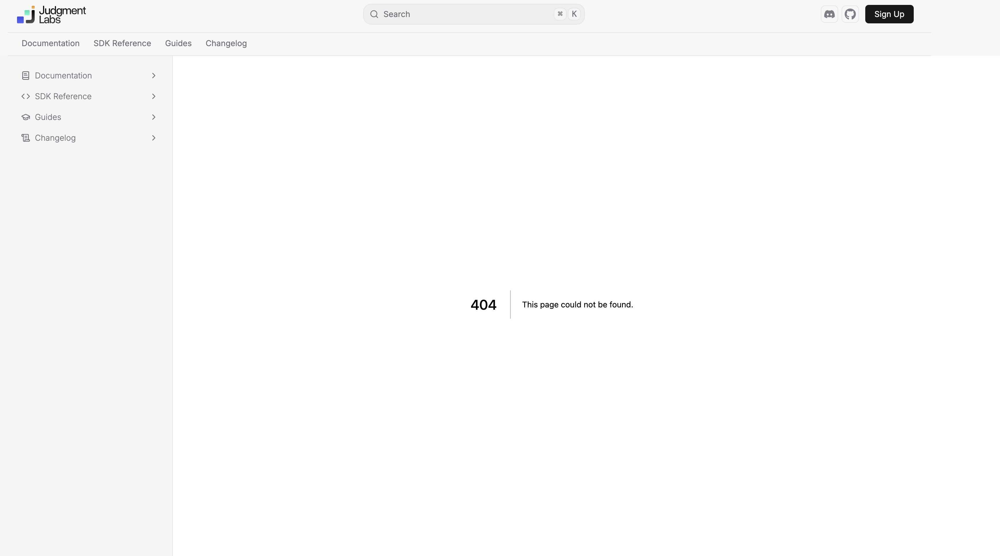

# User Feedback and Potential Improvements

## [Onboarding](https://app.judgmentlabs.ai/app/onboarding):

- The instructions for setting the environment variable could be clearer. While it's implied that the `***` is replaced with the real API key, it might look like a placeholder, leaving users unsure about where to obtain their actual API keys.
  - Possible Solution: Add a caption clarifying that the real API keys are displayed here and will be copied to the clipboard when the copy button is clicked.

## [Online Evaluations Documentations Missing](https://docs.judgmentlabs.ai/quickstarts#online-evaluation)

⬇️

# SDK Improvements: 

